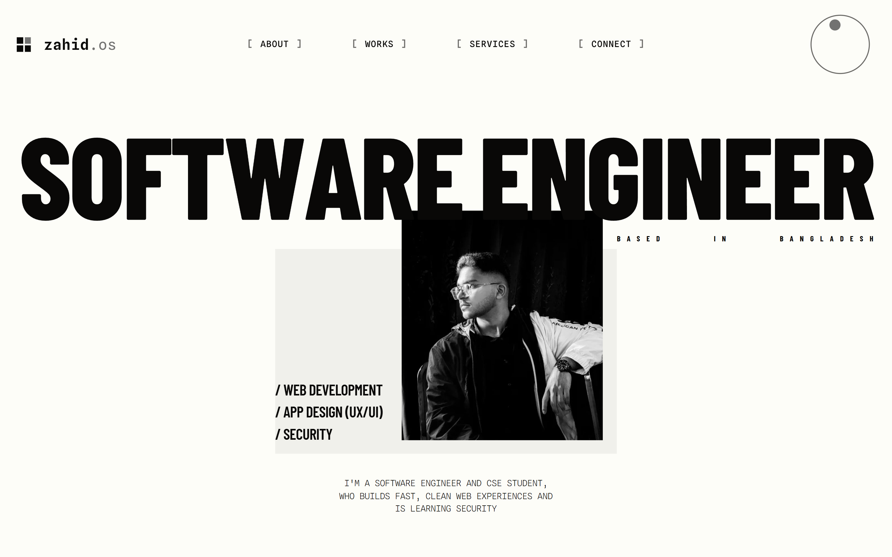

# zahid.os

A personal portfolio built as a single-page "operating system."

Time-of-day theme engine that interpolates between nine palettes in OKLab
color space, a crosshair cursor that locks onto clickable elements, a dial
that drives the palette, a rigid-body letter simulation in the About section,
and a modal project viewer that loads live previews on demand.

## Stack

Plain HTML, CSS, and ES modules. No build step, no bundler, no dependencies.

## Running locally

Any static server works — `fetch()` won't run from `file://`.

    python3 -m http.server 8000

Then open <http://localhost:8000>.

## Structure

    index.html              Entry point
    css/
      reset.css             Box-sizing, scrollbar, base body
      tokens.css            Color tokens (JS overwrites at runtime)
      header.css            Header, nav, dial, logo
      loader.css            Boot loader
      cursor.css            Crosshair cursor
      rail.css              Scroll rail
      reveal.css            Scroll-reveal animations
      one-page.css          Fixed header + section stacking
      perf.css              Layout isolation for smoother scroll
      sections/             One file per page section
    js/
      main.js               Entry — wires everything together
      theme.js              Color engine + dial
      loader.js             Boot sequence
      scramble.js           Nav glyph animation
      cursor.js             Crosshair cursor
      data.js               Static data (paths, projects, services)
      templates.js          Section HTML templates
      dom.js                Shared DOM references
      utils/
        color.js            OKLab color math (pure)
        scroll.js           Shared scroll position
      sections/             One module per section
      works/                Project modal + terminal subsystem
    data/
      wk-live.json          Project previews, fetched on demand
    assets/
      favicon.svg
      img/

## How it works

- **Theming.** `js/theme.js` holds nine palettes keyed to a 24-hour dial.
  `js/utils/color.js` interpolates them in OKLab (perceptually even), and
  `paint(t)` writes the resulting colors back into CSS custom properties.
  Dragging the header dial, or letting the loader sweep the whole day at
  boot, both call `paint(t)`.

- **Sections.** All sections live in the same HTML document — the nav scrolls
  between them and each one runs its own init function once at boot. The
  About scene's letter physics is a small rigid-body simulation in
  `js/sections/about.js`.

- **Project previews.** Four entire websites are stored in
  `data/wk-live.json` (~900 KB) and only fetched the first time a project
  card is clicked. This keeps the initial page under 100 KB on the wire.

- **Scroll behavior.** The loader locks scrolling (`html.sl`) until the boot
  sequence finishes and the page scrolls to top, so a browser refresh never
  flashes a previous position. After that, native `scroll-behavior: smooth`
  takes over.

## Deploying

Fully static. Deploys with zero configuration to:

- **GitHub Pages** — push to `main`, enable Pages in settings
- **Vercel** — import the repo, done
- **Netlify** — drag the folder in, done
- **Cloudflare Pages** — connect the repo, done

## Browser support

ES modules, `IntersectionObserver`, `color-mix()` — works in all modern
browsers. No IE, no legacy Safari.

## License

MIT — see [LICENSE](LICENSE).